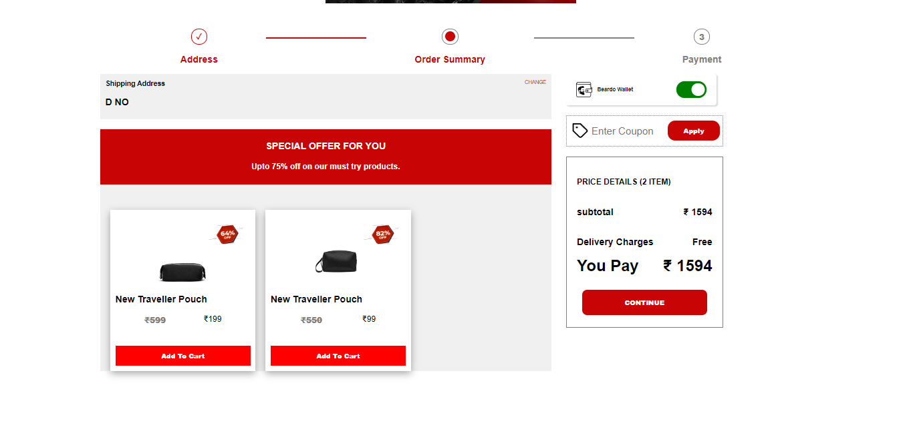

## Description
Producer of personal care products intended to offer assistance in maintaining and grooming beards. The company’s products include beard washes, balm, hair growth oil, serum, face washes, wax, soaps and beard combs among others, thereby enabling consumers to pamper their face mane in a hassle-free manner.

Real Website: — [www.beardo.in](www.beardo.in)

Our Clone website link -[https://beardoclone.netlify.app/](https://beardoclone.netlify.app/)

And here is the link of a small presentation we did on it - [Click here to view](https://drive.google.com/file/d/1j1ucLXD_mg3m3juLfFxofo2fnYxu_jI2/view)

## Creators

- Arshiya Moin

- Chakravarthi Pasumarthi

- Devesh Goyal

- Naga Polamarasetti

- Shubham Verma

- Swati Sharma

## Masai School

at the end of unit Masai team is assigned a project and the project is based on the technology we are learned in the whole unit in this project we are used HTML, CSS and JAVASCRIPT(Es6) and APIs

## Technologies we used

- HTML

- CSS

- JAVASCRIPT

- Browser Local Storage for Cart Section

- Google and Facebook Api’s for a quick Login and Signup

## Features

- Login and logout functionality.
- Navbar contains various product categories.
- On product page particular category products with multiple sorting options displayed.
- On Checkout page price is calculated dynamically.

## `Home page`

## `Login and Signup`

- On this page users can signup/sign-in based on whether the user is already registered or not.

## `Product Page`

- On the Product Page header, user can click on the ‘Login’ Icon to either Sign In or Create an Account
- Once the user has logged in, they are taken back to the Landing Page.
- On the top navbar, the user can navigate to the following categories: `All products`, to open the products page
- On the Products Page
- On clicking on each product ‘Quick View’ button. Clicking on it, the user will be shown the details of the product along with the option to add the product to their   Cart.
- On hovering on products user get button called ‘BUY NOW’ bye clicking on it products get add into cart, and user will get popup to go for cart page or checkout       page.
- On the Cart page
- The user can remove a product from the cart.
- Able to Change the quantity of the product

- Place the Order
- On placing the Order, user will redirected to payment page
- Once the payment is done user is will redirected to Home Page.

- A complete detailed product page displays all the details regarding the product, here we have given the user an option to add to the cart option if he/she like to     buy the product.

## `Cart Page`

- Cart page has all the items that are added to the cart/bag by the user.
  After adding items user need to give his residential where he wants the delivery and press the continue button .
  Now user need to provide his card details for online payment and then he can pay the bill amount online.
  User can also avail promo codes for discount too.
  Now Roles and Responsibilities of Team Members
  Arshiya Moin — Header And Footer

- Chakri — Cart, Payment

- Devesh Goyal — Login Signup

- Naga Polamarasetti — Wallet, Checkout

- Swati Sharma — Product page

- Shubham Verma — Home page

## Key Learning Points and Improvements that Can be Made
- I learned a lot in this project I learned that I was not the best at collaborating but I will learn from my mistakes and will work on my collaboration skill so that   I can be a good teammate. I will make sure that I will not repeat the same mistake. Other then that as a team we are a good and encouraging team like if we a         teammate needs any help everyone will provide the that the person needs. We all go well together, we did not get into any conflicts but, we are not perfect like. We   could have improved our timing and some work of styling but overall we were on point and almost perfect with our work and I would like to work with them again.

Thank you for reading.
